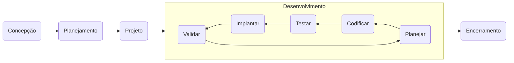
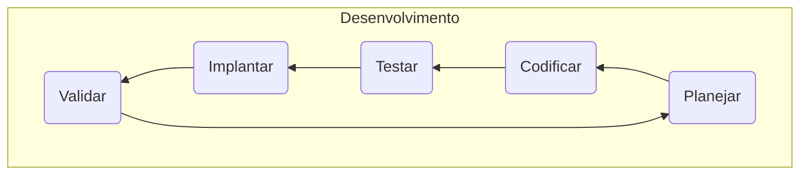

# Processo de Desenvolvimento de Software da Mambee
 
 O objetivo deste documento é descrever o processo base de desenvolvimento de software da Fábrica Escola de Software Mambee.
 
 
 ## Papéis e responsabilidades
 
 ### Líder de Projeto (Team Leader) - Prioritariamente deve ser um Professor
 
 - Liderar o projeto em relação ao orçamento, escopo e cronograma juntamente com o cliente e equipe de desenvolvimento;
 - Apresentar relatórios de acompanhamento e conclusão do projeto;
 - Prover interação entre cliente e equipe;
 - Obter recursos necessários para o planejamento, execução e encerramento do projeto.

### Líder Técnico (Tech Leader)
- Liderar a definição de arquitetura e tecnologias do projeto;
- Liderar e dar suporte a equipe de desenvolvimento em relação ao fluxo de trabalho e uso de ferramentas;
- Gerenciar conflitos e expectativas dentro da equipe de desenvolvimento;
- Garantir a qualidade do código por meio de revisão e alinhamento de estilos e padrões;
- Promover a colaboração e o uso de boas práticas pela equipe de desenvolvimento.

### Dono do Produto (Product Owner - PO)

- Levantar requisitos funcionais e não funcionais de sistema;
- Definir e priorizar os itens do backlog;
- Garantir que o Backlog do Produto esteja acessível e compreensível por todos;
- Detalhar Histórias de Usuários (HU);
- Clarificar e negociar o escopo da Sprint para o time de desenvolvimento;
- Identificar e registrar falhas e não conformidades com requisitos definidos;
- Definir os critérios de aceitação para HUs e defeitos;

### Designer de UX/UI - (UX - User Experience, UI User Interface)

- Definir identidade visual do projeto;
- Projetar interface do aplicativo com o cliente/usuário;
- Desenvolver protótipos de baixa e alta fidelidade;
- Analisar e validar usabilidade da interface gráfica.

### Desenvolvedor Front-end
- Manter a base central de código organizada de acordo com o fluxo de trabalho definido para o projeto;
- Implementar front-end das funcionalidades de acordo com as HUs;
- Implementar requisitos não-funcionais do front-end de acordo com as especificações;
- Refatorar o código-fonte para manter-se atualizado e de acordo com as boas práticas e arquitetura do sistema;
- Criar e manter testes automatizados de unidade e integração de acordo com as HUs;
- Criar e manter o processo de automatização de implantação do sistema.

### Desenvolvedor Back-end
- Manter a base central de código organizada de acordo com o fluxo de trabalho definido para o projeto;
- Implementar back-end das funcionalidades de acordo com as HUs;
- Implementar requisitos não-funcionais do back-end de acordo com as especificações;
- Refatorar o código-fonte para manter-se atualizado e de acordo com as boas práticas e arquitetura do sistema;
- Criar e manter testes automatizados de unidade e integração de acordo com as HUs;
- Criar e manter o processo de automatização de implantação do sistema.

### Testador (Quality Assurance - QA)

- Garantir a qualidade do produto;
- Levantar casos e executá-los;
- Acompanhar a implementação e modificação do sistema de acordo com os requisitos definidos;
- Promover o entendimento dos critérios de aceitação;
- Realizar a abertura e validação de bugs;
- Implementar e executar testes de sistemas (e2e) automatizados.

 ## Ciclo de vida do processo de desenvolvimento de software
 
 O ciclo de vida de desenvolvimento de software - SDLC (Software Development Life Cycle em inglês) é uma estrutura que define todas as etapas envolvidas no processo de planejamento, criação, teste e implantação de software.
 
 o SDLC descreve todas as tarefas necessárias para desenvolver e implantar um software, tendo como principal objetivo guiar o desenvolvimento de um produto de alta qualidade conforme a exigência do cliente. 
 
Principais **benefícios** do SDLC:
- Definir um fluxo de trabalho para toda a equipe;
- Cria um vocabulário comum para cada passo ao longo do desenvolvimento do projeto;
- Definir canais de comunicação e expectativas entre desenvolvedores e partes interessadas do projeto;
- Definir funções e responsabilidades claras para toda a sua equipe (desenvolvedores, designers, gestores, cliente, etc...);

Nosso modelo de ciclo de vida é iterativo e incremental, baseando-se no framework SCRUM. Durante o desenvolvimento do software haverá várias entregas sucessivas ao cliente, que serão desenvolvidas pelo time, onde cada incremento entregue representará um conjunto de funcionalidades do software.
A figura abaixo ilustra o ciclo de vida do processo de desenvolvimento de software da Mambee.

A seguir será detalhado cada etapa do processo:

### 1. Concepção

Quando surgir uma demanda por um novo  projeto, a primeira etapa é a concepção, que envolve a identificação do problema e levantamento dos requisitos iniciais. Isso inclui:

- **Identificação do problema:** Qual o problema é real necessidade do cliente?
- **Disponibilidade e alocação de recursos** : A Mambee tem as pessoas e as ferramentas necessárias para fazer isso?
- **Estimativa de custos**: quanto vai custar?
- **Agendamento de projetos**: como esse projeto se encaixa nos objetivos da Mambee?
- **Alinhamento**: Como esse projeto se conecta à missão e visão da Mambee?
- **Definição do líder do projeto**: Definir o líder do projeto dentro da Mambee.
- **Definição do PO**: Definir o PO do projeto

Nesta fase deve ser envolvido todas as pessoas da Mambee que serão afetadas pelo projeto (Coordenador, professor e equipe de desenvolvimento).

No final da fase de planejamento, o líder do projeto e PO devem ter informações suficientes para montar um escopo de trabalho de alto nível SOW (scope of work em inglês) – um plano que detalha o que está será construído, por que e como se alinha com os objetivos da Mambee.

> **Entradas**: Documento da proposta de projeto [[Template]](#)
> 
> **Saídas**: Documento de escopo de trabalho de alto nível (scope of work - [SOW](https://plan.io/blog/scope-of-work/)) [[Template]](#)
> 
> **Responsáveis**: Líder do projeto e PO
> 
> **Participantes**: Todos os interessados no projeto

### 2. Planejamento

O próximo passo é alinhar junto ao cliente suas necessidades e expectativas e definir o escopo do projeto. Isso inclui:

- Criação do Product Backlog com as funcionalidades da solução proposta (*O Product Backlog é um artefato do Scrum. Nele são registradas as Histórias de Usuários que irão descrever as funcionalidades da solução a ser desenvolvida*.); 
- Priorizar as Histórias de Usuários de acordo com as necessidades do cliente e do produto, levando em consideração as necessidades implícitas identificadas pelo PO, além de ordená-las a fim de entregar maior valor ao cliente.
- Planejar a Sprint 0 para realização da próxima etapa: Projeto.

> **Entradas**: Documento de escopo de trabalho [[Template]](#)
> 
> **Saídas**: Product Backlog priorizado [[Template]](#)
> 
> **Responsáveis**: Líder do projeto e PO
> 
> **Participantes**: Todos os interessados no projeto

### 3. Projeto

Com os requisitos estabelecidos (Histórias de Usuários definidas), é hora de começar a projetar a estrutura interna e interface gráfica do software, além de definir as tecnologias e fluxo de trabalho da equipe. Isso inclui:
- Criação de protótipos de baixa e alta fidelidade (wireframes/protótipos);
- Definição das tecnologias de front-end, back-end e implantação;
- Definição das ferramentas de hospedagem de código, comunicação, documentação e gerenciamento do projeto;  
- Aprovar wireframe/protótipos com os usuários;
- Definir identidade visual do software.

> **Entradas**: Product Backlog priorizado [[Template]](#)
> 
> **Saídas**: Documento de arquitetura [[Template]](#) e Documento de identidade visual [[Template]](#)
> 
> **Responsáveis**: Líder do projeto, PO, Desenvolvedores, Designers e Testadores
> 
> **Participantes**: Todos os interessados no projeto

### 4. Desenvolvimento

Com as funcionalidades, design visual e arquitetura definidas, é hora de construir o software para atender as necessidades do cliente de acordo com os requisitos documentados.

Esta fase é composta por um conjunto de etapas que devem ser executadas em ciclos iterativos e incrementais do início até conclusão do desenvolvimento da solução proposta. Conforme a figura abaixo, as etapas do Desenvolvimento são:  Planejamento, Codificação, Teste, Implantação e Validação. 

A seguir será detalhada cada uma dessas etapas.

#### 4.1. Planejamento
A cada iteração o PO e equipe de desenvolvimento devem se reunir para realizar o planejamento das tarefas que serão executadas na iteração (Sprint), incluindo  o desenvolvimento de novas Histórias de Usuários, correção de defeitos, refatoração e redesign.
Spring/iteração é um período de tempo (recomendamos duas semanas) definido para realização das tarefas/atividades selecionadas. 

#### 4.2. Codificação

#### 4.3. Teste

#### 4.4. Implantação

#### 4.5. Validação

---
## Referências
- [https://plan.io/blog/software-development-process/#3-design-and-prototyping](https://plan.io/blog/software-development-process/#3-design-and-prototyping)
- [https://docs.google.com/document/d/1lbi95nYKUjW-eiylRH-ZZ4hutI__hF0MFh5ewp03gOc/edit?usp=sharing](https://docs.google.com/document/d/1lbi95nYKUjW-eiylRH-ZZ4hutI__hF0MFh5ewp03gOc/edit?usp=sharing)
